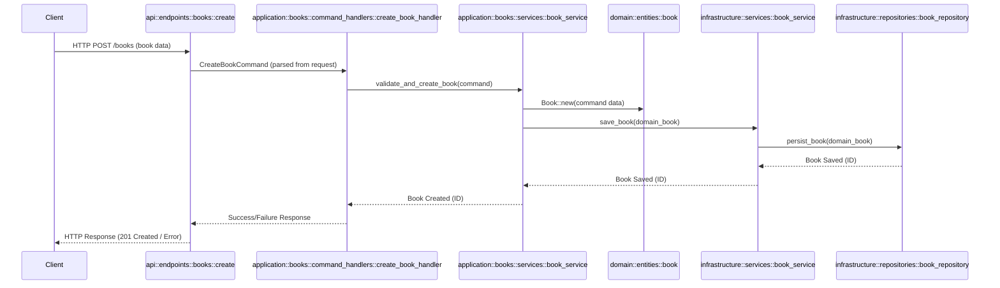

# Warp Signal Clean Architecture Monorepo

This repository implements a modular Rust backend for a library-like system (books, members, transactions) using Clean Architecture. The workspace is organized into several crates, each representing a distinct architectural layer or shared concern.

---

## Table of Contents

- [Project Structure](#project-structure)
- [Package & Source File Overview](#package--source-file-overview)
  - [api](#api)
  - [application](#application)
  - [domain](#domain)
  - [infrastructure](#infrastructure)
  - [common](#common)
- [Inter-Package Dependencies](#inter-package-dependencies)
- [Getting Started](#getting-started)
- [Development](#development)
- [Environment Variables](#environment-variables)
- [Scripts](#scripts)
- [Contributing](#contributing)
- [License](#license)

---

## Project Structure

```
packages/
├── api/
│   ├── .env
│   ├── Cargo.toml
│   └── src/
│       ├── main.rs
│       ├── startup.rs
│       └── endpoints/
│           ├── mod.rs
│           ├── books/
│           │   ├── create.rs
│           │   ├── get_all.rs
│           │   └── mod.rs
│           └── members/
│               └── mod.rs
├── application/
│   ├── Cargo.toml
│   └── src/
│       ├── lib.rs
│       └── books/
│           ├── mod.rs
│           ├── command_handlers/
│           │   ├── create_book_handler.rs
│           │   └── mod.rs
│           ├── query_handlers/
│           │   ├── get_all_books_handler.rs
│           │   └── mod.rs
│           └── services/
│               ├── book_service.rs
│               └── mod.rs
├── common/
│   ├── Cargo.toml
│   └── src/
│       ├── app_error.rs
│       ├── lib.rs
│       └── server_error.rs
├── domain/
│   ├── Cargo.toml
│   └── src/
│       ├── lib.rs
│       ├── commands/
│       │   ├── book_commands.rs
│       │   ├── member_commands.rs
│       │   ├── mod.rs
│       │   └── transaction_commands.rs
│       ├── entities/
│       │   ├── base_entity.rs
│       │   ├── book.rs
│       │   ├── member.rs
│       │   ├── mod.rs
│       │   └── transaction.rs
│       ├── events/
│       │   ├── domain_event.rs
│       │   └── mod.rs
│       └── queries/
│           ├── book_queries.rs
│           ├── member_queries.rs
│           ├── mod.rs
│           └── transaction_queries.rs
└── infrastructure/
    ├── Cargo.toml
    └── src/
        ├── database.rs
        ├── lib.rs
        ├── entities/
        │   ├── book.rs
        │   ├── member.rs
        │   ├── mod.rs
        │   └── transaction.rs
        ├── mappers/
        │   ├── book_mapper.rs
        │   └── mod.rs
        ├── migrations/
        │   ├── book.rs
        │   ├── member.rs
        │   ├── mod.rs
        │   └── transaction.rs
        ├── repositories/
        │   ├── base_repository.rs
        │   ├── book_repository.rs
        │   ├── member_repository.rs
        │   ├── mod.rs
        │   └── transaction_repository.rs
        └── services/
            ├── book_service.rs
            └── mod.rs
```

---

## Package & Source File Overview

### `api` (Presentation Layer)

**Purpose:** Entrypoint for the application. Exposes HTTP endpoints, handles requests, and wires up dependencies.

**Key Files:**

- **main.rs**

  Starts the HTTP server, loads configuration, and calls startup routines.

- **startup.rs**  
  Sets up dependency injection, configures routes, and initializes application state.
- **endpoints/mod.rs**  
  Registers all endpoint modules.
- **endpoints/books/**
  - **mod.rs**: Registers book-related endpoints.
  - **create.rs**: HTTP handler for creating a book (calls application command handler).
  - **get_all.rs**: HTTP handler for fetching all books (calls application query handler).
- **endpoints/members/**
  - **mod.rs**: Registers member-related endpoints.

---

### `application` (Application Layer)

**Purpose:** Contains business use cases and application services. Orchestrates domain logic and coordinates between domain and infrastructure.

**Key Files:**

- **lib.rs**  
  Exposes use cases and services to the API layer.
- **books/mod.rs**  
  Registers book-related application logic.
- **books/command_handlers/**
  - **mod.rs**: Registers command handlers.
  - **create_book_handler.rs**: Handles the "create book" use case.
- **books/query_handlers/**
  - **mod.rs**: Registers query handlers.
  - **get_all_books_handler.rs**: Handles the "get all books" use case.
- **books/services/**
  - **mod.rs**: Registers book-related services.
  - **book_service.rs**: Contains business logic for book operations.

---

### `domain` (Domain Layer)

**Purpose:** Defines core business entities, value objects, commands, queries, and domain events. Contains no external dependencies.

**Key Files:**

- **lib.rs**  
  Re-exports domain modules.
- **commands/**
  - **book_commands.rs**: Command structs for book operations.
  - **member_commands.rs**: Command structs for member operations.
  - **transaction_commands.rs**: Command structs for transaction operations.
  - **mod.rs**: Registers all command modules.
- **entities/**
  - **base_entity.rs**: Base struct for all entities (e.g., id, timestamps).
  - **book.rs**: Book entity definition.
  - **member.rs**: Member entity definition.
  - **transaction.rs**: Transaction entity definition.
  - **mod.rs**: Registers all entity modules.
- **events/**
  - **domain_event.rs**: Base trait/struct for domain events.
  - **mod.rs**: Registers all event modules.
- **queries/**
  - **book_queries.rs**: Query structs for book operations.
  - **member_queries.rs**: Query structs for member operations.
  - **transaction_queries.rs**: Query structs for transaction operations.
  - **mod.rs**: Registers all query modules.

---

### `infrastructure` (Infrastructure Layer)

**Purpose:** Implements external interfaces (e.g., database, external APIs) and provides concrete implementations for domain traits.

**Key Files:**

- **lib.rs**  
  Exposes infrastructure modules.
- **database.rs**  
  Database connection setup and management.
- **entities/**
  - **book.rs**: Database model for books.
  - **member.rs**: Database model for members.
  - **transaction.rs**: Database model for transactions.
  - **mod.rs**: Registers all entity modules.
- **mappers/**
  - **book_mapper.rs**: Maps between domain and database book models.
  - **mod.rs**: Registers all mappers.
- **migrations/**
  - **book.rs**: Book table migrations.
  - **member.rs**: Member table migrations.
  - **transaction.rs**: Transaction table migrations.
  - **mod.rs**: Registers all migrations.
- **repositories/**
  - **base_repository.rs**: Common repository logic.
  - **book_repository.rs**: Book repository implementation.
  - **member_repository.rs**: Member repository implementation.
  - **transaction_repository.rs**: Transaction repository implementation.
  - **mod.rs**: Registers all repositories.
- **services/**
  - **book_service.rs**: Infrastructure-level book services (e.g., external APIs).
  - **mod.rs**: Registers all services.

---

### `common` (Shared Utilities)

**Purpose:** Holds shared types, error definitions, and utility functions used across multiple layers.

**Key Files:**

- **lib.rs**  
  Re-exports common utilities.
- **app_error.rs**  
  Defines application-level error types.
- **server_error.rs**  
  Defines server-level error types.

---

## Inter-Package Dependencies

The dependencies between packages strictly follow Clean Architecture principles:

```
api
│
├── depends on: application, common
│
application
│
├── depends on: domain, common
│
domain
│
├── depends on: common
│
infrastructure
│
├── depends on: domain, common
│
common
```

- **api**: Calls use cases from `application`, uses shared types from `common`.
- **application**: Orchestrates domain logic via traits from `domain`, uses shared types from `common`.
- **domain**: Defines core business logic, uses shared types from `common`.
- **infrastructure**: Implements domain traits (e.g., repositories), uses types from `domain` and `common`.
- **common**: No dependencies; used by all other packages.

**Note:**

- `infrastructure` is injected into `application` at runtime (typically via dependency injection in `api/startup.rs`).
- No package depends on `infrastructure` except for the composition root (`api`), ensuring domain and application layers remain infrastructure-agnostic.

---

## Getting Started

1. **Clone the repository:**

   ```sh
   git clone <repo-url>
   cd <repo-directory>
   ```

2. **Set up environment variables:**  
   Copy `.env.example` to `.env` in the root and in `packages/api` if present.

3. **Build the workspace:**

   ```sh
   cargo build
   ```

4. **Run the API server:**
   ```sh
   cargo run -p api
   ```

---

## Development

- **Run all tests:**  
  `cargo test`

- **Format code:**  
  `cargo fmt`

- **Lint code:**  
  `cargo clippy`

---

## Environment Variables

- **Root `.env`:** Workspace-wide configuration.
- **`packages/api/.env`:** API-specific settings (e.g., server port, DB URL).

---

## Scripts

- **`clean-arch.ps1`:** PowerShell script for cleaning or managing the workspace.

---

## Contributing

1. Fork the repository.
2. Create a new branch.
3. Commit and push your changes.
4. Open a pull request.

---

## License

MIT License. See `LICENSE` for details.

---

**For questions or suggestions, please open an issue or pull request!**

---

## Book Operation Sequence Diagram

Below is a sequence diagram illustrating the flow for a typical "Create Book" operation in this Clean Architecture project. The diagram shows how a request travels through the layers and modules, including the service layer, and highlights the responsibilities and interactions between each component.

[View it here](https://mermaid.live/edit#pako:eNqNVE2P2jAQ_SuWT1RiIZ_N4sNKLbRaTkULpyoSchMD1iZ2aju0W8R_7zhOQgq0ai7xjN97M5k3yglnMmeYYM2-10xkbMHpXtEyFQieiirDM15RYdC84EyY2_yH1RJRjWjFCWEiryQXRhPyTcpXeGWKUcPusKrqmYq8YMqRq4Jn1HApLkxZloDYHhys19ra-y57V3jN1JFn7G_C2l23PW7b8FZpIUvKhVXJm5P9PMMN75i3jKXYKTqozm2sjaozUyv2_5UbnRdWyXsiCvKaG6n6RrZ96i0VTs2Z9fD0BO4Q9LzZrNDqy3qDps0M0Mi-UE4NfefwALPg3hSC5s2wPwJu7oxAI2hRsxztlCyRsuuiTUfviU6lnQFBR1rw3JpmnRz4N2rdvfBbCvDd3AmytQkR7EcH_qPhIWM4d4I0PbZFnG_NuaUNkR3RDpqgClaMa_NPokU-3NSzfaI1FIURLRf3Cl0N5S5h8EFXTjRwZ8cVoZt55_O6zmC79PQz5QXsCnphupJCs4vHgHSr0S5Fh0CjwPP7IlP0SSmp2kJ4jPeK55jADrIxLpmC4UCIT_Y-xebASpZiAsecqtcUp-IMHNjkr1KWHU3Jen_AZEcLDVFd2a1o_zV9VsH_g6m5rIXBxPfDRgSTE_4JYRROgjjwkzAMvCB4H4zxmwV5k_AxDKJZNEsS34-D8xj_asp6k2QWJ1GcxF7oJV78GJ1_AwAHrEo)



**Explanation:**
- **Client** sends a POST request to create a new book.
- **api::endpoints::books::create** parses the request and constructs a `CreateBookCommand`.
- **application::books::command_handlers::create_book_handler** handles the command and delegates to the application service.
- **application::books::services::book_service** contains business logic, validates input, creates the domain entity, and calls the infrastructure service.
- **domain::entities::book** is used for business rules and entity creation.
- **infrastructure::services::book_service** coordinates persistence and may handle cross-cutting concerns.
- **infrastructure::repositories::book_repository** persists the entity to the database.
- The response is propagated back up the stack to the client.

This pattern is followed for other book-related operations (e.g., get all books), with the relevant query handler, service, and repository methods.
