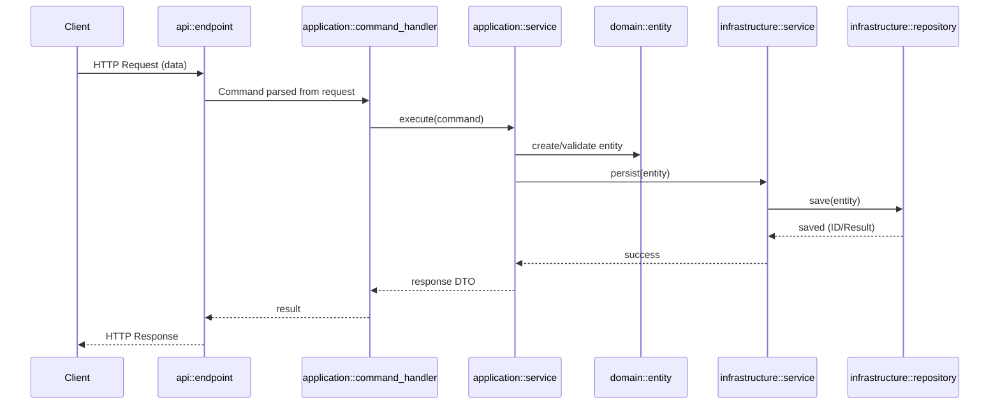

# 🚀 **Warp Rust Clean Architecture Boilerplate**

### A modular, production-ready Rust monorepo implementing Clean Architecture with a fully structured workspace.

<div align="center">

🧩 **Multi-crate Monorepo** • ⚡ **Scalable Architecture** • 🧱 **Clear Layer Boundaries** • 🎯 **Best Practices Included**

</div>

---

## ✨ What This Boilerplate Gives You

* 📁 **Perfectly organized clean architecture workspace** (API ▶ Application ▶ Domain ▶ Infrastructure ▶ Common)
* 🔧 **Pre-wired modules, handlers, services, repos, mappers, migrations**
* 🧪 **Test-ready crates**
* 🔌 **Dependency boundaries enforced by Rust workspaces**
* ⚙️ **Drop-in ready for real projects**
* 📦 **Extensible without breaking architecture rules**

---

## 📦 Monorepo Structure

```
packages/
├── api/              # Presentation layer (HTTP server, endpoints)
├── application/      # Use cases, handlers, orchestration logic
├── domain/           # Entities, commands, queries, domain events
├── database/         # Database, migrations
├── infrastructure/   # Repositories, mappers
└── common/           # Shared utilities & error types
```

---

# 📁 Package Overview

Below is a crisp overview of what each package does — rewritten as *general-purpose modules*, not tied to a specific domain.

---

## 🟦 `api` — Presentation Layer

**Purpose:**
HTTP entrypoint. Handles requests, maps them to application use cases, sets up DI, routing, and service initialization. Based on [warp](https://crates.io/crates/warp).

**Key Components:**

* `main.rs` — server startup, config load
* `startup.rs` — dependency injection + routing
* `endpoints/` — request handlers, grouped by feature

---

## 🟩 `application` — Application Layer

**Purpose:**
Implements use cases, command/query handlers, and high-level application services. Coordinates domain logic while staying infrastructure-agnostic.

**Key Components:**

* Command Handlers
* Query Handlers
* Application Services
* Module registries

---

## 🟥 `domain` — Domain Layer

**Purpose:**
The core. Pure business logic: entities, value objects, aggregates, commands, queries, domain events.

**Key Components:**

* `entities/`
* `commands/`
* `queries/`
* `events/`

*No external dependencies. 100% pure Rust business rules.*

---

## 🟧 `Database` — Minimal Database Connection and migrations

**Purpose:**
Implements storage, persistence, migrations based on [sea-orm](https://crates.io/crates/sea-orm).

**Key Components:**

* Database Connection Helper
* Migrations

---

## 🟧 `infrastructure` — Infrastructure Layer

**Purpose:**
Implements external APIs, mappers, repositories and infra-level services.

**Key Components:**

* DB models
* Mappers (Domain ↔ Storage)
* Infra services

---

## 🟨 `common` — Shared Utilities

Shared error types, abstractions, helpers used across crates.

---

# 🔗 Inter-Package Dependencies

```
api
  ↳ application
  ↳ common

application
  ↳ domain
  ↳ common

domain
  ↳ common

infrastructure
  ↳ domain
  ↳ common

common
  (no deps)
```

**Rules enforced in this boilerplate:**

* `api` = only place where infrastructure is composed and injected
* `application` + `domain` are completely infra-agnostic
* `infrastructure` implements interfaces, but no crate depends on it except the composition root

Clean Architecture **guaranteed**.

---

# ⚙️ Getting Started

```sh
git clone https://github.com/sushant-at-nitor/warp-microservice
cd warp-microservice
cargo build --workspace
cargo run -p api
```

---

# 🛠️ Development

```sh
cargo test     # Run tests
cargo fmt      # Format code
cargo clippy   # Lint
```

---

# 🌱 Environment Variables

* Root `.env` — shared workspace config
* `packages/api/.env` — API-specific settings (port, DB URL, etc.)

---

# 🤝 Contributing

1. Fork
2. Create branch
3. Commit + push
4. Open PR

---

# 📄 License

MIT License.

---

# 🧭 Operation Flow (Sequence Diagram)

Here is the general sequence flow for a typical **create operation** in this boilerplate:



Clean, layered, predictable flow — suitable for any domain.

---
